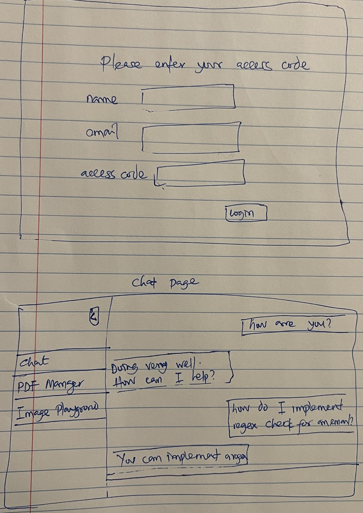
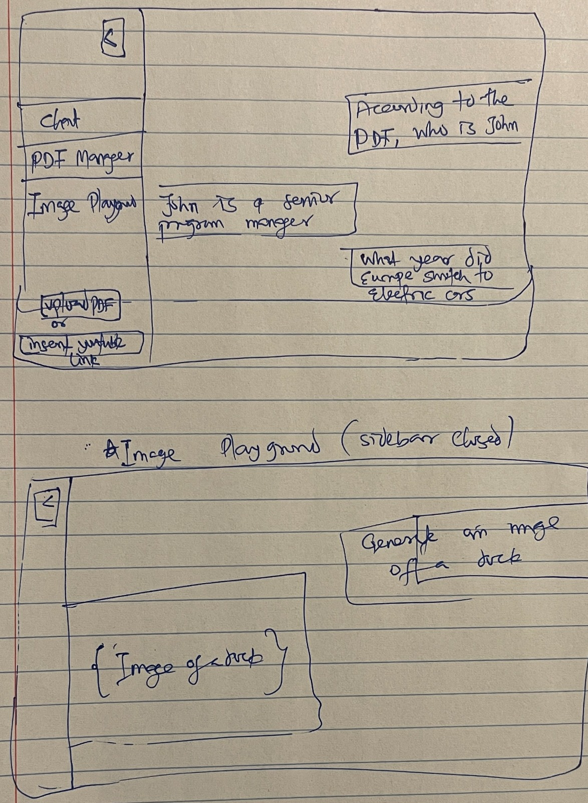

# Project Title
Chatbot

## Overview

An advanced AI-powered application with AI chat, PDF processing and AI image generation. This app will provide a convenient way to interact with OpenAI's powerful language models, such as GPT-3.

I frequently use the free tier of ChatGPT in my day-to-day tasks, but I wanted to do more. To unlock additional features, I would need to subscribe to ChatGPT Plus, which costs $20 per month. However, by using this app to interact with ChatGPT through the OpenAI APIs, I can explore and use it as much as I want while only being charged for the requests I make. This approach can save me over $2,000 annually compared to subscribing to ChatGPT Plus.

While still having access to ChatGPT for everyday use, I can use this app for specific requests. Here are some of the key benefits this app offers me:

- **Unlimited document/image uploads**: Unlike ChatGPT, which has daily limits for image and PDF uploads, this app removes those restrictions.
- **Access to any GPT model**: I can freely choose the model I want, including more advanced, accurate, and capable ones.
- **Greater flexibility in requests**: The app allows me to make requests that ChatGPT doesn't support, such as summarizing YouTube videos, among other advanced functionalities.

### Features

- As a user, I want to be able to chat with an AI.
- As a user, I want to be able to upload a PDF and ask an AI questions about the PDF document.
- As a user, I want to be able to upload an image and ask an AI questions about the image.

## Implementation

### Tech Stack

- Frontend:
    - React

- Backend:
    - Node
    - Express
    - Axios

### APIs

- OpenAI APIs

### Sitemap

- Login page
- Chat page (Landing page)
- PDF Manager page
- Image generation page

### Auth

- Implement a basic access code auth, users will need to provide access code to log in
- Create random access codes (not to be pushed to the server) - and disable after use

### Mockups

#### Login and Chat Page

#### PDF Manager and Image Generations Page

## Roadmap

- Check for input validation for all entries
- Put external request in try catch and handle errors accordingly
- Reusable components and styling
- Middlewares?

### Frontend

- UI:
    - Create a mockup for the four pages
    - Create pages with basic styling and complete app functionalities
    - Create re-usable components
    - Finish up styling

### Backend

- Chat:
    - Update Chat system from terminal to user input
    - Add response streaming feature
    - Implement webscoket for real time communication
    - Add other GPT pro features

- Auth:
    - Implement a basic access code auth, users will need to provide access code to log in
    - Create random access codes (not to be pushed to the server) - and disable after first time use
    - Track token limit for each access code and log users out after reaching limit

- File upload:
    - Allow users to upload PDF, set a PDF size limit.
    - Allow users to image upload.
    - Allow users paste image into the chat
    - Allow users drag/drop PDFs and images

<!-- - Image Generator:
    - Handle image export/download
    - Implement a different image upload feature (Like Fooocus/Claude - but still OpenAI) -->

- Database:
    - Store user email
    - Access Codes and status
    - PDF filename

## Development Progress
1. Backend
    - Successfully implemented chat feature via terminal (8 months ago)
    - Switched to server/client setup (09-05)
    - Successfully sent prompt and displayed response (09-10)
    - Implemented streaming, but getting JSON.parse error becasue streaming breaks response and hereby incomplete JSON (09-11)
    - Edit: Streaming didn't work (09-16)
    - Removed empty lines and strings and response placeholder texts before parsing - successfully stream response but terminal still shows error parsing JSON (09-11)
    - Milestone 1 - Ignoring the terminal error, user can successfully send query and get a response(09-11)
    - Discovered the Langchain package I use to work with YouTube links no longer work today. Not a priority feature. (09-20)
    - PDF manager works for image PDF where text content can't be selected or copied (09-20)

2. Frontend
    - Successfully collect user input and stream streaming response (09-11)
    - Update ChatPage to QuestionPage. QuestionPage - user asks one question and stream ends. Goal for ChatPage - user continues conversation with GPT in stream(09-11)
    - Moved API call from backend to frontend and streaming now works (09-16)
    - Vite is killing me, for two days I can't resolve OpenAIEmbeddings from langchain. I have tried all the methods. Now I'll try to move creatStore function to the backend and then send the vectorized data to the frontend. (feat/chat+streaming - /pull/7) (09-20)
    - Vite is not the problem, rather you can't serve web loaders into a client because their dependencies only work in Node (09-21)